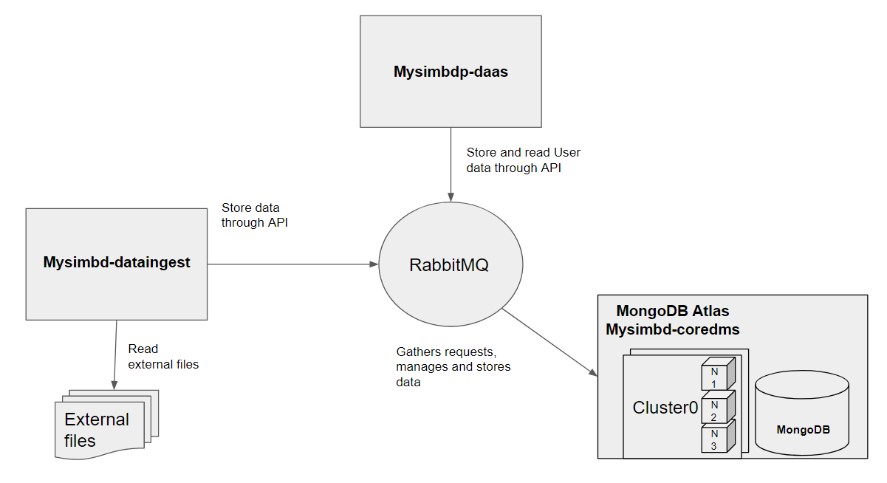

# Assigment 1: Building your Big Data Platform
##Part 1: Design
##### 1.1 Design Design and explain interactions between main components in your architecture of mysimbdp

##### 1.2 Explain how many nodes are needed in the deployment of mysimbdp-coredms so that this component can work property (theoretically based on the selected technology )
As im using MongoDB Atlas, the classical approach would be to have a 2nd node for increasing the availability. We will consider 3 nodes so in case the primary node falls, the 2 duplicates will be ready to keep the platform online. This makes the platform fault-tolerant, also we could buy more clusters for our platform, this clusters would manage the more nodes and therefore scaling our platform horizontally

##### 1.3 Will you use VMs or containers for mysimbdp and explain the reasons for each component

I will use containers instead of VMs. Containers prove to be much more lighter and fast hence enhancing the availability of our data.VMs are isolated and would be useful if we are concerned about security.

##### 1.4. Explain how would you scale mysimbdp to allow a lot of users using mysimbdp-dataingest to push data into mysimbdp

As im using MongoDB Atlas, the cluster I use in there is allocated in Google Cloud Platform service which provides a wide variety of hardware that you can buy, CPU and memory usages that will be available on a dinamic basis if our platform requires it. We can either scale vertically by purchasing another CPU and RAM or scale horizontally by ordering resources and adding more servers containing more clusters. Horizontal scaling is far more productive than vertical for the reason that giving more CPU power or memory to a cluster will always be under the threat of being bombarded with a big number of queries.

##### 1.5 Explain your choice of industrial cloud infrastructure and/or mysimbdp-coredms provider, when you do not have enough infrastructural resources for provisioning mysimbdp

Im using MongoDB Atlas, which offers to choose between AWS, Google or Azure. Google Cloud Service got my attention because we will be able to setup machine learning and big data analytics to our data from the cloud itself.

